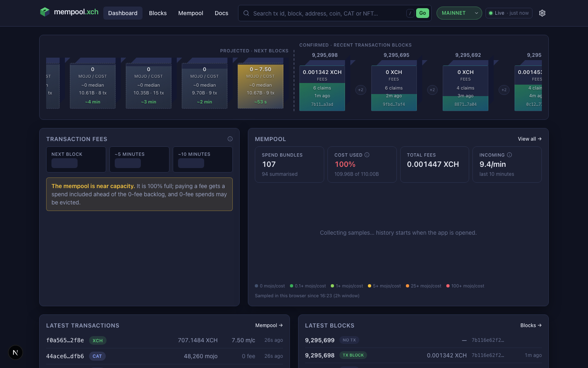

# Visual reference sheet

Reference for backlog TASK-004 / decision-003: the layout was modelled on
[mempool.space](https://mempool.space) (visual reference only; its code is AGPL and nothing was
copied). No screenshot of mempool.space is kept here, since it would reproduce their interface
and marks; open the site to compare. The mempoolxch.space dashboard at 1440 px, captured
2026-09-15 (before the Beidwerk redesign, TASK-105):

What was kept: sticky header with logo, primary nav and a wide search box; the blocks row with
projected blocks left of a dashed divider and confirmed blocks right; fee tiers as small cards;
mempool stats with a stacked graph; two lists (latest transactions, latest blocks) below.

What is different on purpose: Chia-green primary accent instead of purple/blue, fee bands in
mojos per CLVM cost with an explicit 0-fee band, block cubes carry Chia data (fee-rate range,
cost fill, reward claims, farmer), and non-transaction blocks appear as compact +N markers.
